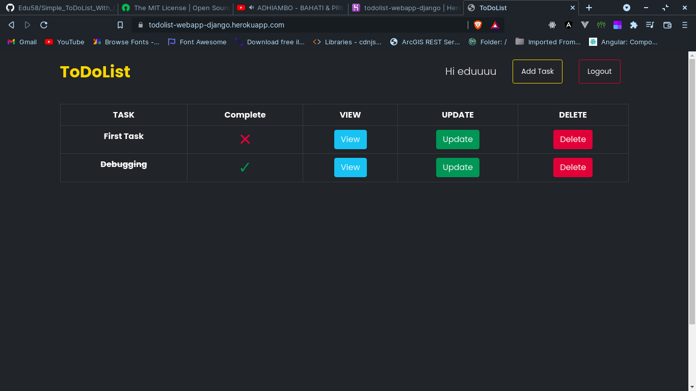

# Simple_ToDoList_With_Django
A simple todo list web app made with django and boootstrap 5

### Live Link - https://todolist-webapp-django.herokuapp.com/

### Summary
It uses bootstrap5 for the UI. It is fullt mobile responsive. For the database, the webapp uses PostgreSQL. It has basic login and signup functionality. You can add tasks and mark them as completed or not yet completed. If the task is competed, i will add a strikethrough on the task It is hosted on Heroku App.

### Known bugs
Can't recover password.

### License
Copyright 2021 Edwin Karimi

Permission is hereby granted, free of charge, to any person obtaining a copy of this software and associated documentation files (the "Software"), to deal in the Software without restriction, including without limitation the rights to use, copy, modify, merge, publish, distribute, sublicense, and/or sell copies of the Software, and to permit persons to whom the Software is furnished to do so, subject to the following conditions:

The above copyright notice and this permission notice shall be included in all copies or substantial portions of the Software.

THE SOFTWARE IS PROVIDED "AS IS", WITHOUT WARRANTY OF ANY KIND, EXPRESS OR IMPLIED, INCLUDING BUT NOT LIMITED TO THE WARRANTIES OF MERCHANTABILITY, FITNESS FOR A PARTICULAR PURPOSE AND NONINFRINGEMENT. IN NO EVENT SHALL THE AUTHORS OR COPYRIGHT HOLDERS BE LIABLE FOR ANY CLAIM, DAMAGES OR OTHER LIABILITY, WHETHER IN AN ACTION OF CONTRACT, TORT OR OTHERWISE, ARISING FROM, OUT OF OR IN CONNECTION WITH THE SOFTWARE OR THE USE OR OTHER DEALINGS IN THE SOFTWARE.
